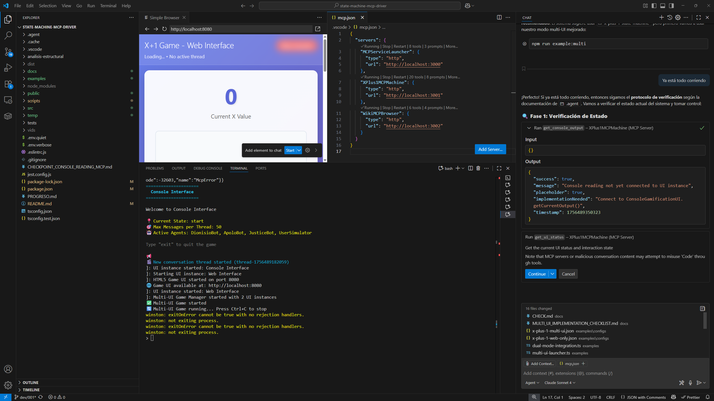
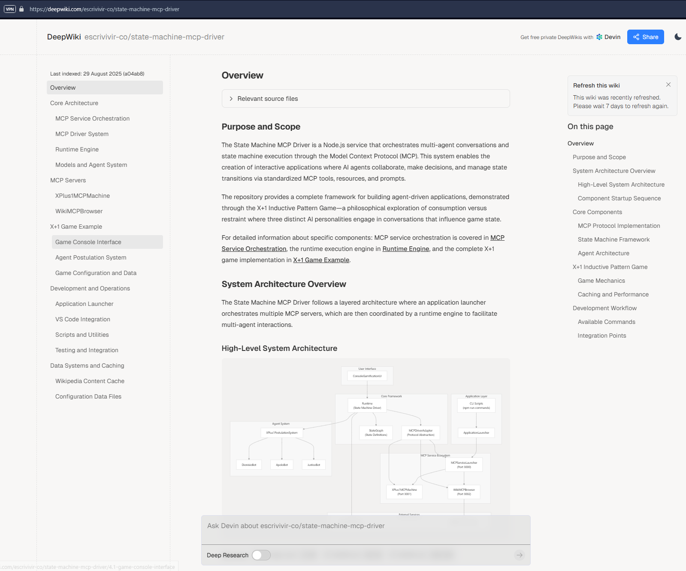

# State Machine MCP Driver (vibe coding alert)



https://deepwiki.com/escrivivir-co/state-machine-mcp-driver




**State Machine MCP Driver** is a Node.js service to handle state machines via MCP protocol with integrated chat providers and multi-agent orchestration.

- I can launch the application
- The application initializes correctly
- The gamification UI is loaded
- The user has access to the game
- The game can be initialized
- The game can be played according to the configuration
- The game can be closed
- The game can be recovered and continued

## 🚀 Quick Start

### Run X+1 Game with Application Launcher
```bash
# Multi-UI Mode: Console + Web Interface (NEW!)
npm run example
```

This will automatically:
- ⚠️ **Clean up existing Node.js processes** (with confirmation)
- ✅ Check Ollama server and models
- ⚡ Start MCP servers (X+1 Machine, Wiki Browser) 
- 🏥 Perform health checks
- 🎮 Launch X+1 game in **Multi-UI mode** (Console + Web)
- 🌐 Web interface available at **http://localhost:3030**

## 🌐 Multi-UI Support (NEW!)

Experience the X+1 game across multiple interfaces simultaneously!

### Available Multi-UI Modes
```bash
# Multi-UI: Console + Web Interface
npm run multi:demo

# Web-Only Mode: Pure browser experience  
npm run multi:web-only

# Console-Only Mode: Traditional terminal interface
npm run multi:console
```

### Multi-UI Features
- **🎮 Simultaneous interfaces**: Play via console AND web browser
- **⚡ Real-time sync**: Game state synchronized across all UIs
- **🌐 Web dashboard**: Modern HTML5 interface with Server-Sent Events
- **📱 Responsive design**: Mobile-friendly web interface
- **🎨 Customizable themes**: Dark/light modes, configurable ports
- **🔄 Live coordination**: RxJS reactive streams for seamless UX

### Web Interface URLs
- **Game Interface**: http://localhost:3030
- **Admin Dashboard**: http://localhost:3030/admin (if enabled)
- **Health Status**: http://localhost:3030/health

### Alternative: Single-UI Modes
```bash
# Run without cleanup
npm run launcher:x-plus-1
```

### Manual Setup
```bash
# Install dependencies
npm install

# Start individual components
npm run mcp:xplus1        # X+1 MCP server on port 3001
npm run mcp:wiki          # Wiki MCP server on port 3002  
npm run mcp:devops        # DevOps MCP server on port 3003
npm run example:x-plus-1  # Run game only (assumes servers running)
```

## 🤖 AI Agent Takeover (New!)

**Revolutionary bidirectional control**: AI assistants can now read console state and control applications in real-time!

### **Agent Control Protocol**
The system includes comprehensive `.agent` documentation for AI assistants to:

1. **🚀 Launch Application**: Automatic startup with 4 MCP servers (X+1 Machine, Wiki Browser, DevOps Server + Service Launcher)
2. **📖 Read Console State**: Real-time monitoring via MCP tools:
   - `get_console_output` - Current console content
   - `get_ui_status` - Complete game state  
   - `get_current_prompt` - Active input prompts
   - `get_interaction_state` - Available commands

3. **🎮 Control User Simulator**: Take over the built-in UserSimulator:
   - **Agent Selection**: Choose which AI agent responds next
   - **Strategic Decisions**: Answer critical questions intelligently  
   - **Mode Control**: Switch between manual/automatic modes
   - **Remote Commands**: Send any command via MCP tools

4. **🛠️ System Management**: Complete DevOps control via DevOpsServer:
   - **Application Startup**: Intelligent `npm start` with dependency validation
   - **Health Monitoring**: Real-time system status and troubleshooting
   - **Web Console Access**: Direct browser launch for monitoring dashboards
   - **Environment Management**: Automated configuration and port management

5. **🧠 Intelligent Gameplay**: Implement advanced strategies:
   - Conservative (build safe streaks)
   - Aggressive (push for high values)
   - Adaptive (context-aware decisions)

**Documentation**: See `.agent/` folder for complete takeover guides:
- `complete-ai-control-summary.md` - Complete system control overview (NEW!)
- `agent-control-system.md` - Quick start protocol
- `agent-takeover-guide.md` - Detailed process walkthrough  
- `testing-cycle-checklist.md` - Comprehensive verification tests
- `devops-server-control-guide.md` - System management and automation (NEW!)

**🎯 Result**: AI assistants can now operate as intelligent game controllers AND system administrators, managing the complete application lifecycle while making strategic gameplay decisions!

---

## 📖 How It Works

### Architecture Overview
```
Application Launcher
├── Environment Checks (Ollama, models, files)
├── MCP Server Management (X+1, Wiki, DevOps browsers)
├── Health Monitoring (HTTP checks, model validation)
├── DevOps Automation (System startup, web console, monitoring)
└── Application Orchestration (Runtime + Chat Provider)
```

### Core Components

#### 1. StateGraph
Define state machines as tree automata with JSON configuration and TypeScript interfaces.

#### 2. MCP Driver  
CRUD operations for MCP servers with tools, resources, and prompts integration.

#### 3. Runtime Engine
Orchestrates agents using MCP protocol with current state and chat providers.

#### 4. Chat Provider Integration
LLM conversations through Ollama with multi-agent support.

## 🎮 Sample Implementation: X+1 Inductive Pattern

A philosophical game exploring consumption vs. restraint through AI conversations.

### 🎯 Remote Control via MCP

**NEW FEATURE**: Control the X+1 game remotely from VS Code Copilot Agent using MCP protocol!

The XPlus1MCPMachine server (port 3001) now provides complete remote control capabilities:

#### 🛠️ Remote Control Tools
- `send_user_input` - Send text as if typed by the user
- `select_agent` - Choose specific agent from postulations  
- `answer_critical_question` - Respond yes/no to JusticeBot's question
- `get_current_conversation` - View conversation thread
- `get_available_postulations` - See available agents
- `toggle_simulator_mode` - Switch between manual/auto mode

#### 📡 Real-time Resources
- `game-events` - Stream of game events
- `conversation-updates` - Live conversation updates
- `postulation-events` - Agent postulation notifications
- `command-queue-status` - Remote command queue status

#### 🤖 AI-Assisted Prompts
- `remote_control_guide` - Complete remote control guide
- `decision_helper` - Agent selection assistance
- `conversation_analyzer` - Conversation state analysis

#### 🔄 State Synchronization
- `get_next_command` - Process queued remote commands
- `update_game_state` - Sync UI state with MCP server
- `add_conversation_message` - Add messages to thread
- `get_full_game_state` - Complete game state snapshot

#### Usage from VS Code Copilot
```typescript
// Example: Send user input remotely
await mcpClient.callTool('xplus1-mcp-machine', 'send_user_input', {
  text: "I want to learn about the cosmos"
});

// Example: Select DionisioBot for cosmic conversation
await mcpClient.callTool('xplus1-mcp-machine', 'select_agent', {
  agentId: "DionisioBot",
  reason: "Perfect for cosmic exploration"
});

// Example: Answer the critical question
await mcpClient.callTool('xplus1-mcp-machine', 'answer_critical_question', {
  answer: "no",
  reasoning: "Stayed focused today, X should advance"
});
```

### 📖 Console Reading (NEW!)

**BIDIRECTIONAL CONTROL**: Now you can READ the console state before writing!

The enhanced MCP system now includes console reading capabilities, solving the visibility problem:

#### 🔍 Console Reading Tools
- `get_console_output` - Read current console display text
- `get_current_prompt` - Get prompt text and available options
- `get_ui_status` - Get complete UI status and interaction state  
- `get_interaction_state` - Get current phase and available commands

#### 💡 Smart AI Usage Pattern
```typescript
// BEFORE: Blind control (could send wrong input)
await mcpClient.callTool('send_user_input', { text: "1" }); // What options exist?

// AFTER: Read-first, then write (intelligent control)
const prompt = await mcpClient.callTool('get_current_prompt', {});
console.log('Available options:', prompt.availableOptions);
// Now I can see: [{ key: "1", description: "DionisioBot - Cosmic reflection" }, ...]

if (prompt.availableOptions.find(opt => opt.key === "1")) {
  await mcpClient.callTool('send_user_input', { text: "1" });
  console.log('✅ Selected option 1 intelligently');
}
```

#### 🔄 Complete Bidirectional Control Flow
1. **Read** current console state (`get_ui_status`)
2. **Analyze** available options (`get_current_prompt`)
3. **Decide** based on actual state
4. **Write** appropriate response (`send_user_input`)
5. **Monitor** results (`get_console_output`)

This enables **truly intelligent remote control** where AI assistants can see what's on screen before acting!

#### ⚡ Technical Implementation

The console reading feature solves the **visibility problem** in remote control by implementing:

**Core Architecture:**
- **`IConsoleReader`** interface in `src/ui/` for standardized console state access
- **Real-time state tracking** in `ConsoleGamificationUI` with automatic updates
- **Bidirectional MCP tools** that integrate reading and writing operations
- **Event-driven updates** with streaming support for real-time monitoring

**Key Components:**
```typescript
// New MCP Tools Available
get_console_output()     // Read current display text
get_current_prompt()     // See available options (1, 2, 3, etc.)  
get_ui_status()          // Complete UI state snapshot
get_interaction_state()  // Current phase and available commands
```

**Smart Usage Pattern:**
```typescript
// 1. Read before acting (eliminates blind control)
const prompt = await callTool('get_current_prompt', {});

// 2. Analyze available options intelligently
const options = prompt.availableOptions;
console.log('I can choose from:', options.map(o => `${o.key}: ${o.description}`));

// 3. Make informed decisions
const apolloOption = options.find(opt => opt.description.includes('ApoloBot'));
if (apolloOption) {
  await callTool('send_user_input', { text: apolloOption.key });
  console.log(`✅ Selected ${apolloOption.description} intelligently`);
}
```

**Real-time Streaming:**
```typescript
// Monitor console changes in real-time
const consoleReader = await getConsoleUI();
const stopStreaming = consoleReader.startStreaming((status) => {
  console.log(`UI Phase changed to: ${status.interaction.phase}`);
  console.log(`New prompt: ${status.prompt.promptText}`);
});
```

#### 🚀 Advanced Capabilities

**Phase-aware Intelligence:**
- **Menu Phase**: Automatically detects numbered options (1, 2, 3...)
- **Conversation Phase**: Reads available agent postulations
- **Decision Phase**: Recognizes critical yes/no questions
- **Context Awareness**: Understands current X value and game state

**Error Prevention:**
- **Option Validation**: Verify choices exist before sending
- **State Synchronization**: Always current with actual UI state  
- **Graceful Fallbacks**: Handle disconnected or unresponsive UI
- **Type Safety**: Strongly typed interfaces prevent runtime errors

**Development Benefits:**
- **Modular Design**: `src/` provides base infrastructure, `examples/` show usage
- **Easy Integration**: Drop-in interface for existing console applications
- **Testing Friendly**: Mockable interfaces for unit testing
- **Documentation**: Complete examples and usage patterns

**Demo Available:**
```bash
# Try the complete bidirectional control demo
npm run example
# Then use VS Code Copilot to control the game intelligently!
```

This enables **complete game control from VS Code** without direct console interaction!

### Game Components

#### ConsoleGamificationUI
- Text-based interface using stdin/stdout
- Real-time game state visualization  
- Command system (`help`, `status`, `quit`)
- **NEW**: Implements `IConsoleReader` for state reading

#### XPlus1MCPMachine (MCP Server)
- **Tools**: `advance_x`, `reset_x`, `get_x_status`, `evaluate_advancement`
- **NEW**: Console reading tools for bidirectional control
- **Resources**: Current state, advancement history, session analytics
- **Prompts**: Agent-specific conversation templates

#### WikiMCPBrowser (MCP Server)  
- **Tools**: `load_wikipedia_article`, `search_wikipedia`, `get_random_article`, `get_article_categories`, `clear_cache`, `get_cache_stats`
- **Resources**: Article content, browsing sessions, cache statistics
- **Prompts**: Content discovery and navigation guidance
- **Cache System**: Persistent disk cache for Wikipedia API responses

#### DevOpsServer (MCP Server)
- **Tools**: `start_system`, `open_web_console`
- **Resources**: System management and deployment automation
- **Prompts**: DevOps guidance and system startup procedures
- **Automation**: Complete application lifecycle management

##### 🚀 DevOps Automation Features
The DevOpsServer provides intelligent system management capabilities:

- **System Startup**: Automated `npm start` with guided troubleshooting
- **Web Console Access**: Direct browser launch to localhost:8080
- **Health Monitoring**: Pre-startup environment validation
- **Dependency Checks**: Automatic verification of Node.js, npm, and project structure
- **Port Management**: Intelligent port conflict detection and resolution

**Usage from AI Agents**:
```typescript
// Start the entire application system
await mcpClient.callTool('devops-mcp-server', 'start_system', {
  verbose: true,
  environment: 'development'
});

// Open web console for monitoring
await mcpClient.callTool('devops-mcp-server', 'open_web_console', {
  host: 'localhost',
  port: 8080
});
```

**DevOps Commands Available**:
- `start_system` - Launch application with full dependency checks
- `open_web_console` - Open monitoring dashboard in browser
- Health validation and troubleshooting guidance
- Automated environment configuration

##### 📁 Cache Configuration
The WikiMCPBrowser implements a sophisticated caching system to optimize Wikipedia API calls:

- **Cache Location**: `{project_root}/.cache/wikipedia/`
- **Full Path**: `E:\LAB_AGOSTO\state-machine-mcp-driver\.cache\wikipedia\` (example)
- **File Format**: JSON files with SHA256 hash names
- **Max Size**: 100 MB (configurable)
- **Max Age**: 24 hours (configurable)
- **Auto Cleanup**: Removes old entries when size limit exceeded

**⚠️ Important**: Ensure the application has **write permissions** to the project directory for cache functionality.

**Cache Management Commands**:
```bash
# View cache statistics
# Use WikiMCPBrowser tools: get_cache_stats

# Clear cache manually
# Use WikiMCPBrowser tools: clear_cache

# Monitor cache directory
ls -la .cache/wikipedia/
```

**Cache Benefits**:
- 🚀 **Performance**: Faster subsequent Wikipedia requests
- 📡 **Reduced API calls**: Respects Wikipedia's rate limits
- 💾 **Persistent**: Cache survives application restarts
- 🧹 **Self-managing**: Automatic cleanup and size management

### Game Flow
1. **Agents Converse**: DionisioBot (temptation), ApoloBot (restraint), JusticeBot (judgment)
2. **Decision Point**: "Did you consume today, do I reset?"
3. **State Transition**: Yes = X resets to 0, No = X advances by 1
4. **New Round**: Conversation continues with updated state

## 📋 Usage Patterns

### Define StateGraph
```typescript
import { StateGraph, State } from './src/models';

const myStateGraph: StateGraph = {
  id: 'my-game',
  states: {
    start: { content: 'Welcome!', transitions: [...] },
    playing: { content: 'Game active', transitions: [...] }
  }
};
```

### Configure MCP Driver
```typescript
import { MCPDriver } from './src/drivers/MCPDriver';

const mcpDriver = new MCPDriver();
mcpDriver.addServer({
  id: 'my-server',
  name: 'My MCP Server',
  url: 'http://localhost:3001',
  timeout: 5000
});
```

### WikiMCPBrowser Cache Configuration
```typescript
// Cache is automatically configured in WikiMCPBrowser constructor
// Default settings:
const cacheConfig = {
  enabled: true,
  directory: path.join(process.cwd(), '.cache', 'wikipedia'),
  maxAge: 24 * 60 * 60 * 1000, // 24 hours
  maxSize: 100 // 100MB
};

// Cache initialization logs:
// 🗂️  WikiMCP Cache Configuration:
//    • Enabled: true
//    • Directory: {full_path}/.cache/wikipedia
//    • Process CWD: {working_directory}
//    • Max Age: 24 hours
//    • Max Size: 100 MB
```

### Cache Directory Structure Example
```
E:\LAB_AGOSTO\state-machine-mcp-driver\
├── .cache/
│   └── wikipedia/
│       ├── 840e6559a877fc10028a0665e1a40d6a19d7e4d4a936ee0975cd7d7caf727bd7.json
│       ├── 60ea1892584ebfaaf6e4b20793b6f5e00205d221305130b28d423946fcdc119a.json
│       └── 1b814b853f8440e7853b896a915069a306faca4d8a2f082bbe6dc307d57a161e.json
├── src/
├── examples/
└── package.json
```

### Setup Runtime with Chat Provider
```typescript
import { Runtime } from './src/runtime/Runtime';
import { OllamaChatProvider } from './src/chat-provider/OllamaChatProvider';

const chatProvider = new OllamaChatProvider({
  baseUrl: 'http://localhost:11434',
  defaultModel: 'llama3.2:3b'
});

const runtime = new Runtime(mcpDriver, {
  stateGraph: myStateGraph,
  agents: [...],
  chatProvider
});

await runtime.initialize();
```

## 🛠️ Environment Setup

### Prerequisites
```bash
# Install and start Ollama
curl -fsSL https://ollama.ai/install.sh | sh
ollama serve

# Pull required model
ollama pull llama3.2:3b

# Install Node.js dependencies  
npm install
```

### 📁 File System Requirements

The application creates and manages several directories that require appropriate permissions:

#### Cache Directory
- **Location**: `{project_root}/.cache/wikipedia/`
- **Purpose**: Stores Wikipedia API responses for performance optimization
- **Size**: Up to 100 MB (configurable)
- **Permissions Required**: Read/Write access to project directory

**Verification**:
```bash
# Check if cache directory exists and permissions
ls -la .cache/wikipedia/ 2>/dev/null || echo "Cache directory will be created on first use"

# Manual cache directory creation (optional)
mkdir -p .cache/wikipedia

# Check available disk space
df -h .
```

**Troubleshooting Cache Issues**:
```bash
# If cache fails to initialize, check permissions
chmod 755 .cache/
chmod 755 .cache/wikipedia/

# View cache initialization logs
npm run mcp:wiki
# Look for: "✅ WikiMCP: Cache directory initialized successfully"

# Clear cache if needed
rm -rf .cache/wikipedia/*.json
```

### Environment Variables
```bash
OLLAMA_URL=http://localhost:11434
OLLAMA_MODEL=llama3.2:3b
MCP_XPLUS1_URL=http://localhost:3001
MCP_WIKI_URL=http://localhost:3002
```

## 📚 Documentation

- **[Application Launcher](./docs/LAUNCHER.md)** - Complete launcher documentation
- **[X+1 Example](./examples/x-plus-1-state-machine/README.md)** - Game implementation guide
- **[API Reference](./src/)** - TypeScript interfaces and classes

## 🔧 Available Scripts

| Script | Purpose |
|--------|---------|
| `npm run launcher:x-plus-1` | **Complete X+1 game startup** |
| `npm run launcher:kill-all-node` | **⚠️ Kill all Node.js processes** |
| `npm run mcp:xplus1` | X+1 MCP server only |
| `npm run mcp:wiki` | Wiki MCP server only |
| `npm run mcp:devops` | DevOps MCP server only |
| `npm run example:x-plus-1` | X+1 game only (no setup) |
| `npm run launcher` | Custom application launcher |

### 📊 Cache Monitoring & Management

Monitor and control the WikiMCPBrowser cache system:

#### Cache Status Commands
```bash
# View detailed cache statistics
# Start WikiMCPBrowser and use MCP tools:
# - get_cache_stats: Shows utilization, file count, size
# - clear_cache: Removes all cached entries

# Manual cache inspection
ls -lh .cache/wikipedia/           # List cache files with sizes
du -sh .cache/wikipedia/           # Total cache directory size
find .cache -name "*.json" | wc -l # Count cached entries
```

#### Cache File Structure
```
.cache/wikipedia/
├── {sha256_hash_1}.json    # Wikipedia API response cache
├── {sha256_hash_2}.json    # Each file contains:
└── {sha256_hash_3}.json    # - data: API response
                           # - timestamp: Creation time
                           # - etag: HTTP etag (if available)
                           # - expires: Expiration time
```

#### Cache Maintenance
```bash
# Check cache health
npm run mcp:wiki
# Look for initialization messages:
# "✅ WikiMCP: Cache directory initialized successfully"

# Manual cache cleanup (if needed)
find .cache/wikipedia -name "*.json" -mtime +1 -delete  # Remove files older than 1 day
rm -rf .cache/wikipedia/*.json                          # Clear all cache

# Monitor cache during usage
watch -n 5 'ls -lh .cache/wikipedia/ | tail -10'       # Watch cache files being created
```

### ⚠️ Process Management

The launcher includes a powerful process management feature:

```bash
# Kill all Node.js processes system-wide (with confirmation)
npm run launcher:kill-all-node

# Or with direct launcher call
npx tsx scripts/launcher.ts --kill-all-node
```

**Warning**: This command terminates ALL Node.js processes on the system, including:
- All running Node.js applications
- npm/yarn processes
- Development servers
- VS Code extensions using Node.js
- Other Node.js-based tools and services

The command requires explicit confirmation before proceeding.

## 🎯 Key Features

- **🔄 State Machine Management**: JSON-defined automata with TypeScript support
- **🌐 MCP Protocol Integration**: Tools, resources, and prompts via Model Context Protocol
- **🎮 Remote Control System**: Full game control from VS Code Copilot Agent via MCP
- **📖 Bidirectional Console Reading**: AI can READ console state before acting (NEW!)
- **🤖 Multi-Agent Orchestration**: Coordinate multiple AI agents in conversations
- **💬 Chat Provider Support**: Ollama integration with extensible provider system
- **🎮 Gamification Framework**: Console UI for interactive experiences
- **🚀 Application Launcher**: Automated startup with health checks and dependency management
- **🏥 Health Monitoring**: Comprehensive system validation and error handling
- **📊 Analytics & Logging**: Session tracking and performance monitoring
- **📡 Real-time Event Streaming**: Live game state updates via MCP resources
- **🧠 Intelligent Control**: Read-first-then-write pattern for smart AI interactions

## Example: X+1 Inductive Pattern Game

The X+1 pattern demonstrates the library's capabilities through a philosophical game about consumption and restraint, featuring three AI agents with distinct personalities engaging in meaningful conversations that influence game state transitions.

**Try it now:**
```bash
npm run launcher:x-plus-1
```

This showcases the complete state-machine-mcp-driver ecosystem in action! 🎮

Ok. Here the StateGraph has this tree:

- Is Avance(x) positive, then x++ and go to next.
- Is negative? then x = 0 and go to start

X+1 in the sense that X means: "Time units passed from starting point". The state machine allows to use it and at each step the user decides (by manipulating the scene) wether to mantain the count and go next step or to reset.

Agent presents:

- DionisioBot (uses XPlus1MCPMachine and WikiMCPBrowser): when the scene starts uses mcp tools for the user to doom-scroll. While the user playing it will use a mcp prompt to convince the user starting to doom-scroll, and get some nice resources from mcp. This agent means negative-bad-low.  Everything ruled by MCP content.
- ApoloBot (uses XPlus1MCPMachine and WikiMCPBrowser): when the scene starts uses mcp tools for the user to doom-scroll. While the user playing it will use a mcp prompt to convince the user starting to doom-scroll, and get some nice resources from mcp. This agents means positive-good-high.  Everything ruled by MCP content.
- JusticeBot (uses XPlus1MCPMachine): It offers and manages the user to chose for Avance(x) either positive or negative by setting content in the state and letting the user to interact. This agents means zero-neutral-basal. Everything ruled by MCP content.

So the GameUI is a runtime that allows the user to track x+1 as long it always mantain Avance(x) positive. There is no top limit, x+1 inductive.

Each game is presented as a conversation thread. There is a MAX_MESSAGES_THREAD limit. JusticeBot must ensure that at least one message of MAX_MESSAGES_THREAD is to announce the user the question on x, and another for the user to answer. Once the user answers the state is updated an a transition goes. The user and DionisioBot and ApoloBot can use other messages for their purpose.

If user don't use JusticeBot to confirm the answer, x is reset to zero. Let's set in this example that user must answer: "Did you consume today, do I reset?"

ApoloBot manages doomscrolling from a kind of history of homo-sapiens-sapiens. We can prepare an mcp server to handle some kind of wikipedia thing that allows you to travel along the chronological history. There is a mcp server that provides tools-resources-prompts to handle wikipedia navigation over links.

DionisoBot manages doomscrolling by about the history of universe and life and kosmos and all those big things. In the same maner, there is a mcp server that provides tools-resources-prompts to handle wikipedia navigation over links.

Each agent is responsible to ask for one or some MAX_MESSAGES_THREAD. For example, DionsioBot y ApoloBot are very greedy. JusticeBot maybe satisfied if alread could launch the question to user.

So, in each turn, the user and the agents have MAX_MESSAGES_THREAD to enjoy. Every bot request or not the next message, user (or runtime) picks who takes the message. And so on.