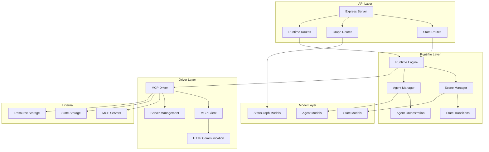

# Arquitectura Detallada del Sistema

## Estructura de Directorios Propuesta

```
state-machine-mcp-driver/
├── src/
│   ├── models/
│   │   ├── StateGraph.ts          # Interfaces y tipos para gráficos de estado
│   │   ├── State.ts               # Definición de estados y datos de usuario
│   │   └── Agent.ts               # Definición de agentes del sistema
│   ├── drivers/
│   │   ├── MCPDriver.ts           # Controlador principal MCP
│   │   ├── MCPClient.ts           # Cliente HTTP para MCP
│   │   └── MCPTypes.ts            # Tipos específicos de MCP
│   ├── runtime/
│   │   ├── Runtime.ts             # Motor de ejecución principal
│   │   ├── SceneManager.ts        # Gestor de escenas
│   │   └── AgentManager.ts        # Gestor de agentes
│   ├── api/
│   │   ├── routes/
│   │   │   ├── states.ts          # Rutas para gestión de estados
│   │   │   ├── graphs.ts          # Rutas para gráficos de estado
│   │   │   └── runtime.ts         # Rutas para control del runtime
│   │   ├── middleware/
│   │   │   ├── auth.ts            # Middleware de autenticación
│   │   │   └── validation.ts      # Validación de datos
│   │   └── server.ts              # Configuración del servidor Express
│   ├── utils/
│   │   ├── logger.ts              # Sistema de logging
│   │   ├── config.ts              # Configuración de la aplicación
│   │   └── validators.ts          # Validadores de datos
│   └── index.ts                   # Punto de entrada principal
├── tests/
│   ├── unit/
│   ├── integration/
│   └── fixtures/
├── docs/
├── config/
└── dist/
```

## Diagrama de Componentes



## Patrones de Diseño Utilizados

### 1. Repository Pattern
- **MCPDriver**: Actúa como repositorio para la comunicación con servicios externos
- **Beneficio**: Abstrae la lógica de persistencia y comunicación

### 2. Factory Pattern
- **Runtime**: Crea instancias de agentes según configuración
- **Beneficio**: Centraliza la creación de objetos complejos

### 3. Observer Pattern
- **State Transitions**: Los agentes pueden suscribirse a cambios de estado
- **Beneficio**: Permite reactividad en el sistema

### 4. Strategy Pattern
- **Agent Behavior**: Diferentes estrategias de comportamiento según el rol del agente
- **Beneficio**: Flexibilidad en la implementación de comportamientos

## Interfaces Principales

### StateGraph Interface
```typescript
interface StateGraph {
  id: string;
  name: string;
  description?: string;
  initialState: string;
  states: Record<string, StateNode>;
  version: string;
  metadata?: Record<string, any>;
}
```

### Runtime Interface
```typescript
interface RuntimeConfig {
  mcpServerId: string;
  graphId: string;
  userId: string;
  sessionTimeout?: number;
  agentConfigs?: AgentConfig[];
}
```

### MCP Driver Interface
```typescript
interface MCPDriver {
  addServer(config: MCPServerConfig): void;
  removeServer(serverId: string): boolean;
  executeTool(serverId: string, toolName: string, params: any): Promise<any>;
  getResource(serverId: string, resourceId: string): Promise<any>;
  getPrompt(serverId: string, promptId: string, variables?: any): Promise<string>;
}
```

## Flujo de Datos

### 1. Inicialización del Sistema
```
Usuario → API → Runtime → MCP Driver → Servidor MCP
                   ↓
              StateGraph ← Servidor MCP
```

### 2. Transición de Estado
```
Usuario → UI → API → Runtime → Validación → MCP Driver → Persistencia
                      ↓
               Notificación a Agentes
```

### 3. Ejecución de Herramientas
```
Agente → Runtime → MCP Driver → Servidor MCP → Resultado → Agente
```

## Consideraciones de Escalabilidad

### Horizontal Scaling
- **MCP Servers**: Múltiples servidores MCP pueden ser añadidos dinámicamente
- **Load Balancing**: El driver puede distribuir carga entre servidores

### Vertical Scaling
- **Memory Management**: Estados grandes pueden ser paginados
- **Caching**: Implementar cache para gráficos de estado frecuentemente usados

### Performance Optimizations
- **Connection Pooling**: Reutilizar conexiones HTTP con servidores MCP
- **Async Processing**: Operaciones no bloqueantes para mejor throughput
- **State Compression**: Comprimir estados grandes para reducir transferencia de datos
